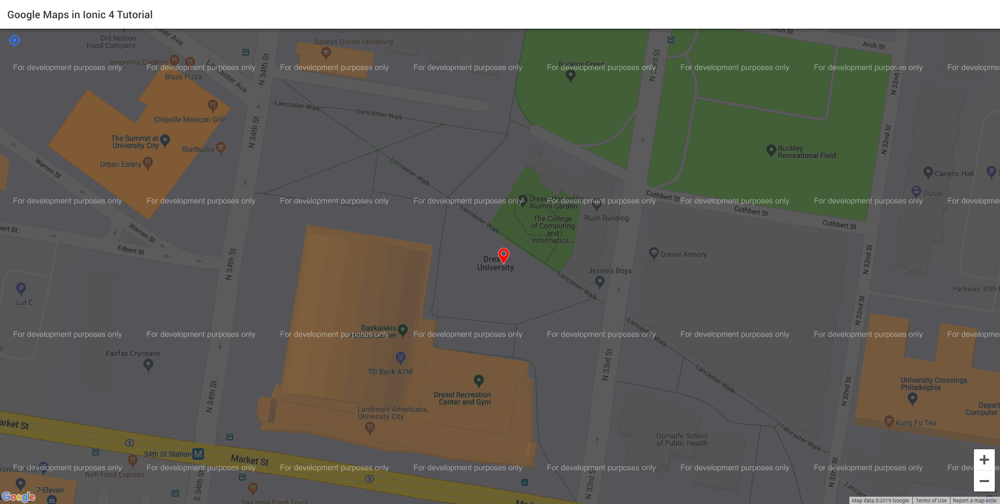

#Google Maps in Ionic 4

In this tutorial, you will learn how to set up Google Maps in Ionic 4. 

I will assume that you know the basics of `Ionic`.


```$xslt
Requirement:
Ionic 4
```


##Step 1: Set up
Open your terminal and go to the directory that you want to save this project under.

Let's create a blank Ionic project using this command below:

`ionic start google-maps-tutorial`

`Ionic` might ask you whether you want install `AppFlow` for free. `AppFlow` is basically an Ionic service
that automates many things (You can read more about it [here](https://ionicframework.com/appflow)). 
For this tutorial, we do not need `AppFlow`. So, go ahead and click no.

Now, `google-maps-tutorial` project should be now installed. Go to `google-maps-tutorial` directory by:

`cd google-maps-tutorial`

Also, let's open this project in your favorite editors. These are the choices you can use:
* Sublime Text
* Atom
* Visual Studio Code
* Webstorm (it is free for students. this is my personal favorite :D )


##Step 2: Get Google Maps API Key

In order to use Google services, we will need an API key. Since Google has detailed documentation on this,
I will not go in details for this. You can find the documentation [here](https://developers.google.com/maps/documentation/javascript/get-api-key).


##Step 3: Install Node and npm

To install all the plugins in this project, we will use `npm` which is a package manager. In order to use `npm`, you
need to install `Node.js`. You can install it through its website [here](https://nodejs.org/en/).

Run this in your terminal to check whether you have installed successfully:

`which node`

`which npm`

If the terminal prints out the location of those two commands, that means you have installed successfully.
If not, please see a TA for help!


##Step 4: Install Google Maps Plugin

Go back to your terminal window. <b>Make sure you are in the project directory</b>.

To install Google Maps plugins, we will run two commands:

```
npm install @ionic-native/core@beta @ionic-native/google-maps@beta

ionic cordova plugin add cordova-plugin-googlemaps --variable API_KEY_FOR_ANDROID="..." --variable API_KEY_FOR_IOS="..."
```

Make sure you replace with `...` with your API key that you got in step 1. You can use same API
for both Android and iOS.


##Step 5: Code Time :)

Open `home.page.ts` in your project. This file acts like a controller for your home page.

Import all Google Maps stuff that we will need. Copy this above `@Component` line.

```angular2
import {
  GoogleMaps,
  GoogleMap,
  GoogleMapsEvent,
  GoogleMapOptions,
  CameraPosition,
  Marker,
  ILatLng,
  GoogleMapsMapTypeId
} from '@ionic-native/google-maps';
``` 

Then, under `HomePage` class, create `GoogleMap` variable.


```angular2
map: GoogleMap;
``` 


So, you should have this so far:

```angular2
import { Component } from '@angular/core';


import {
  GoogleMaps,
  GoogleMap,
  GoogleMapsEvent,
  GoogleMapOptions,
  CameraPosition,
  Marker,
  Environment,
  ILatLng,
  GoogleMapsMapTypeId
} from '@ionic-native/google-maps';


@Component({
  selector: 'app-home',
  templateUrl: 'home.page.html',
  styleUrls: ['home.page.scss'],
})
export class HomePage {

  mapAPIKey = '<YOUR_API_KEY>';
  map: GoogleMap;


}
```


Now, we are going to write code that we create our map.

In Angular, there is something called `lifecycle`. You can read more about it (here)[https://angular.io/guide/lifecycle-hooks].

In our project, we will use `ngOnInit()` from Angular lifecycle. This method will automatically be called when the
user first enters the page. In order to use this method, we need to implement `OnInit` interface. You should have:


```angular2
import { Component, OnInit } from '@angular/core';


import {
  GoogleMaps,
  GoogleMap,
  GoogleMapsEvent,
  GoogleMapOptions,
  CameraPosition,
  Marker,
  Environment,
  ILatLng,
  GoogleMapsMapTypeId
} from '@ionic-native/google-maps';


@Component({
  selector: 'app-home',
  templateUrl: 'home.page.html',
  styleUrls: ['home.page.scss'],
})
export class HomePage implements OnInit {

  mapAPIKey = '<YOUR_API_KEY>';
  map: GoogleMap;

  constructor() { }

  ngOnInit(): void {
      
  }
}
```

Now, let's write out `loadMap()` method. This method will actually loads the map on to the UI.

```angular2
loadMap() {
    const mapOptions: GoogleMapOptions = {
      mapType: GoogleMapsMapTypeId.NORMAL,
      gestures: {
        scroll: true,
        tilt: true,
        zoom: true,
        rotate: true
      },
      preferences: {
        building: true
      }
    };


    /* if this map is load faster than DOM then call this method again */
    try {
      this.map = GoogleMaps.create('map_canvas', mapOptions);

      const cameraPosition: CameraPosition<ILatLng> = {
        target: {
          lat: 39.9566,
          lng: -75.1899
        },
        zoom: 20,
        tilt: 30
      };

      this.map.moveCamera(cameraPosition).then(() => {
        const marker: Marker = this.map.addMarkerSync({
          title: 'Drexel',
          icon: 'red',
          animation: 'DROP',
          position: {
            lat: 39.9566,
            lng: -75.1899
          }
        });

        marker.on(GoogleMapsEvent.MARKER_CLICK).subscribe(() => {
          console.log('Marker Click');
        });
      });


    } catch (err) {
      console.log('Cannot find map canvas. Calling loadMap again');
      this.loadMap();
      return;
    }

  }
```

In the method above, we set up Google Maps options. Then, we find in the DOM an element that has an `id`
of `map_canvas` and store it in our GoogleMap object that we declare earlier. The reason I add a `try` `catch`
here because sometimes,  `loadMap()` gets executed faster than `DOM` loads. This will throw an error because
the `map_canvas` element has not yet rendered. 

Then, we move the camera on Google Maps to the coordinate that we want. We also, create
a marker on that coordinate.


Now, open `home.page.html`. We will add the `map_canvas` element. Make sure you make your `div` height and width
100%.


```html
<ion-header>
  <ion-toolbar>
    <ion-title>
      Google Maps in Ionic 4 Tutorial
    </ion-title>
  </ion-toolbar>
</ion-header>

<ion-content>

  <!-- Google Maps Canvas -->
  <div style="height: 100%; width: 100%" id="map_canvas">
  </div>

</ion-content>
``` 


##Step 6: Run Time :)

Since GoogleMaps will only work with native platforms, `ionic serve` will not work properly. 

So we will create `browser` platform to test it. You can also create `ios` or `android` platform.
With this tutorial, it would easier for me to create `browser` platform.

Run this:

`ionic cordova run browser`


You should see something like this:




##Conclusion:

In this project, I also added a button on top right that we relocate back to where we marked. So check it out. 

If you have any questions, feel free to reach out.

If you see any mistakes, please feel free to let me know. 

I hope you find this helpful. :) 


